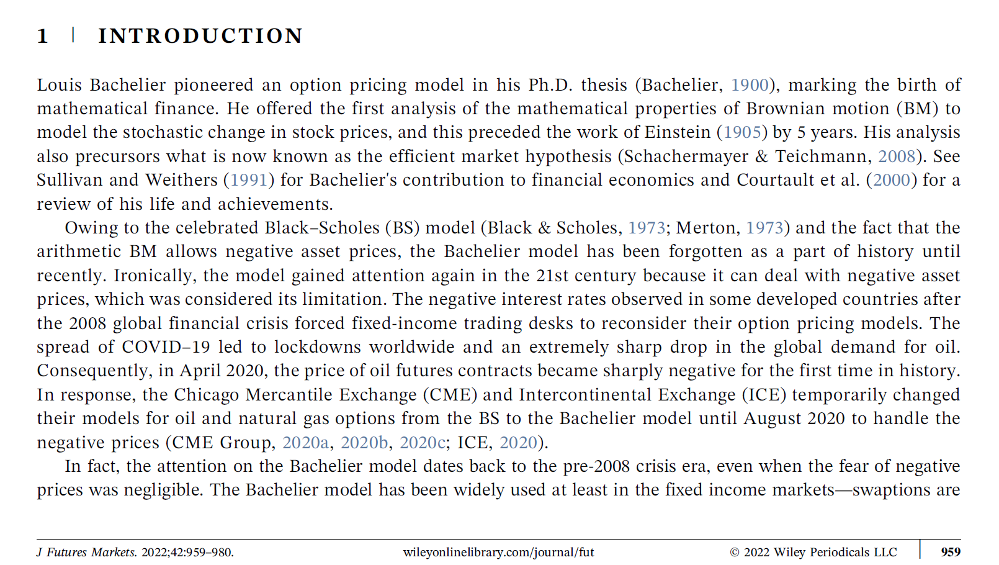

# A Few Things to Remember for Thesis Format

## Reference / Citation
* Difference between textual versus parenthetical citations:
  * Textual citation: part of the sentence 
    > Choi et al. (2020) investigate ...
  * parenthetical citation: outside the sentence
    > The futures are important (Choi et al. 2020).

* `China National Standard GB/T 7714` is the standard citation format for thesis. 
  * `Choi (2019)` (single author) or  `Choi et al. (2019)` / `CHOI 等 (2019)` (multiple authors)
  * Use Zotero to generate the reference list.
  * For Englihs version, you may use `APA 7th edition` style
  * In general, be consistent.
* Be careful with the plural form:
  * (O) Choi et al. (2020) `find` that ... 
  * (X) Choi et al. (2020) `finds` that ... 
* Make sure that there is no missing reference in bibliography section 

## Language and Tone
* Do not use informal English:
  * No ': `It's` --> `It is`, `can't` --> `cannot`
  * `pretty`, `quite` --> `very`, `significantly`
  * `some` --> `several`, `a few`
* Use subject "I". It is better than "the author"
  * Example: I contribute to the literature by ...
  * Use "author" to refer to the authors of the references
* Make sure to correct grammatical mistakes by running software (e.g. [www.grammarly.com](https://app.grammarly.com/))

## Use of Acronym
  * E.g., Black-Scholes (`BS`) formula, Asset pricing theory (`APT`)
  * Define in the parenthesis () in the first usage. After that, you may use acronyms. 
    * Black-Scholes (`BS`) formula
    * Black-Scholes (henceforth, `BS`) formula
    * Black-Scholes (thereafter, `BS`) formula
  * If there are many of acronyms, it is better to give a table of acronyms in the beginning (between abstract and text).
  * Abstract is considered as an separate document. Apply the same rule above in abstract. Define first before use any acronym.

# Defense Presentation

## Defense presentation is as important as thesis! Make your best effort on the slides.

* Make introduction interesting 
* Put a "contribution slide" before the main result slides
  * Summarize your contribution
  * You may repeat it as the conclusion slide
* Effectively use underline, boldface font, color to emphasize.
* Extra slides after "Thank you" slide: 
  * E.g. robustness check. Gives an impression of your effort.
* Come to research seminar and watch how they are organized
* Practice! Practice! Practice!
  * Do mock defense several times (among friends or before advisor).
