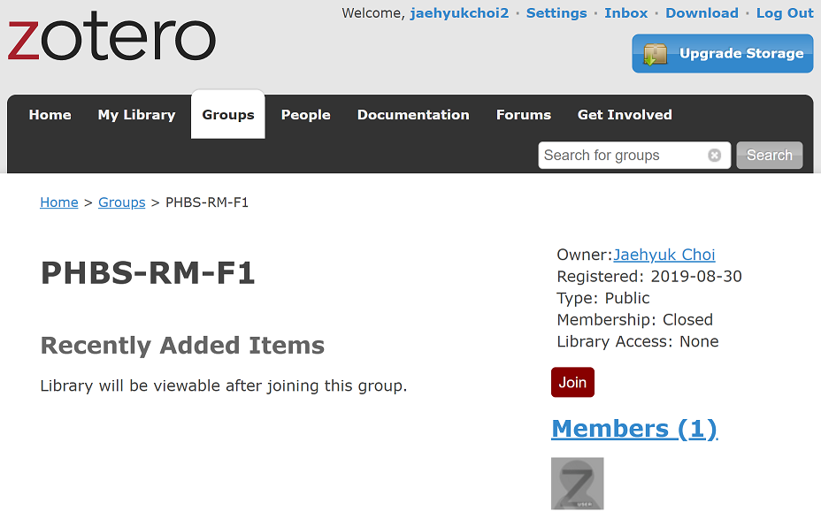
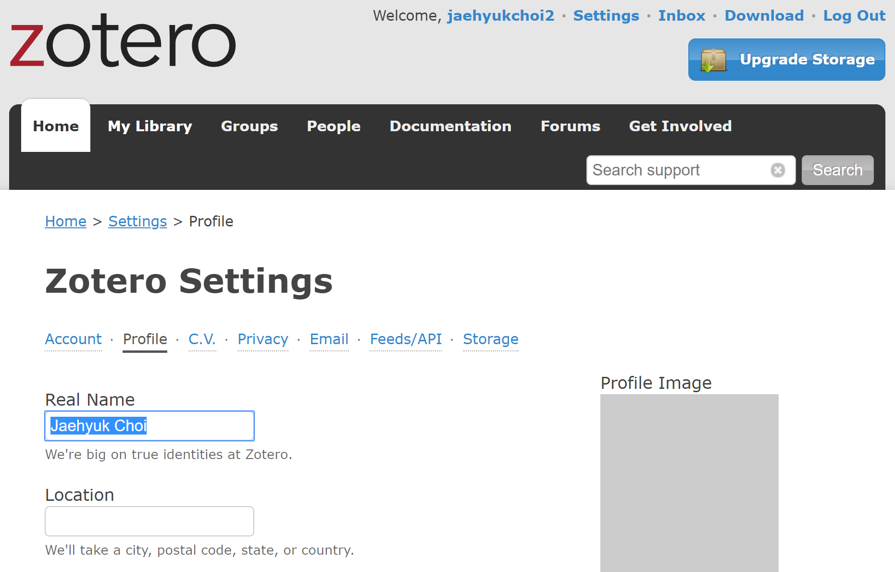
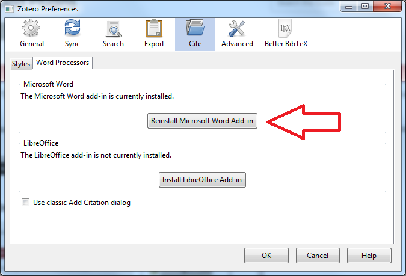

# Zotero
* [Zotero.org](https://www.zotero.org): Open-source reference management software to manage bibliographic data and related research materials
* Easy to add reference information (no manual typing) with browser connector.
* Easy to cite references during writing with MS Word plubgin/Latex.
* Can attach PDFs (any file). Free space up to 300 MB. 
* `My Library` vs `Group Libraries`: easy to share research papers among friends or with thesis advisor.
* [Group Library: RM-F1](https://www.zotero.org/groups/2363301/phbs-rm-f1): papers to be covered in class are uploaded.
* Can organize/classify papers by `collections`. One paper can belong to multiple collections.

## Installation and Class Group Library
* Install Zotero (Zotero for your OS + Browser Connector): [Download](https://www.zotero.org/download/)
* Create your account (free) and join the [Group Library: RM-F1](https://www.zotero.org/groups/2363301/phbs-rm-f1)

* Make sure to put your full name under profile

## Zotero plug-in for MS Word
* Install MS Word plugin: `Edit` - `Preferences` - `Cite` - `Word Processors`

